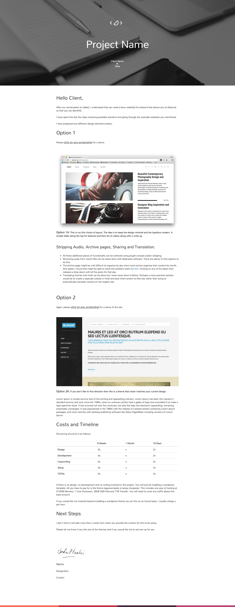

# Proposal Template

You can use this template to send beautiful proposals to clients.

View the template here http://joshpitzalis.github.io/proposal/

Please build on it and then send me a pull request with improvements.

A proposal generator used called [Beagle](http://getbeagle.co/) shut down and I couldn't find anything simple to replace it so I made this simple template.

## Structure
+ demonstrate understanding
+ stick to two directions, with one clear preference (used to use three but saw that three options make it harder for the client to sacrifice two)
+ purpose each direction
+ justify each option in a caption (if you have more than one option in each direction)
+ explain pricing structure
+ layout next steps

## Tech used:
+ bootstrap ( I'm sorry, I will remove this when I get some time, made super quick and I didn't want to mess around with responsive images and mobile sizing)
+ sass (I used Scout to compile)
